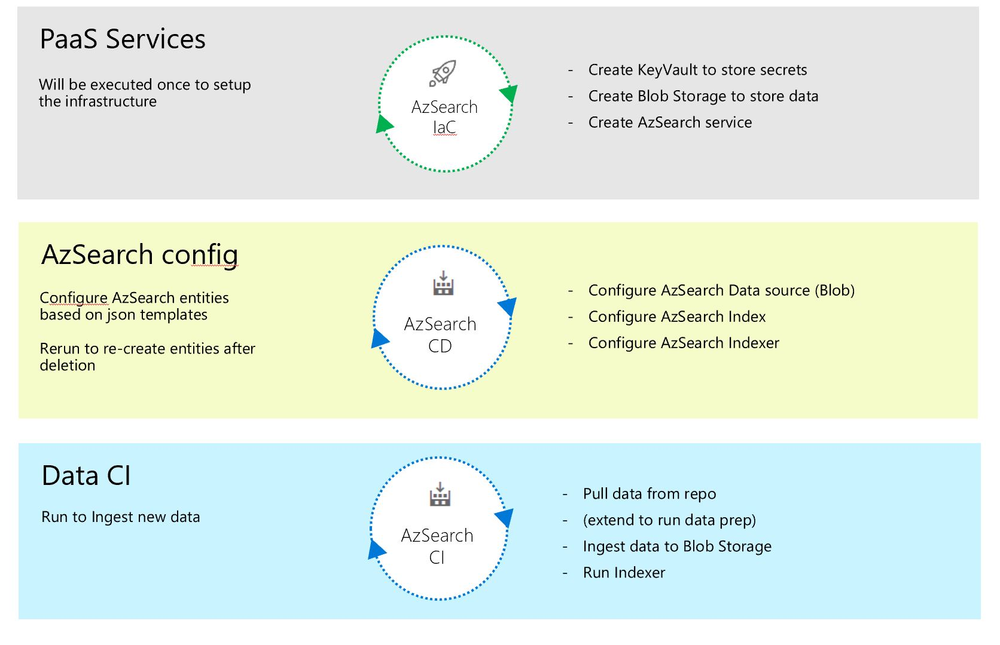
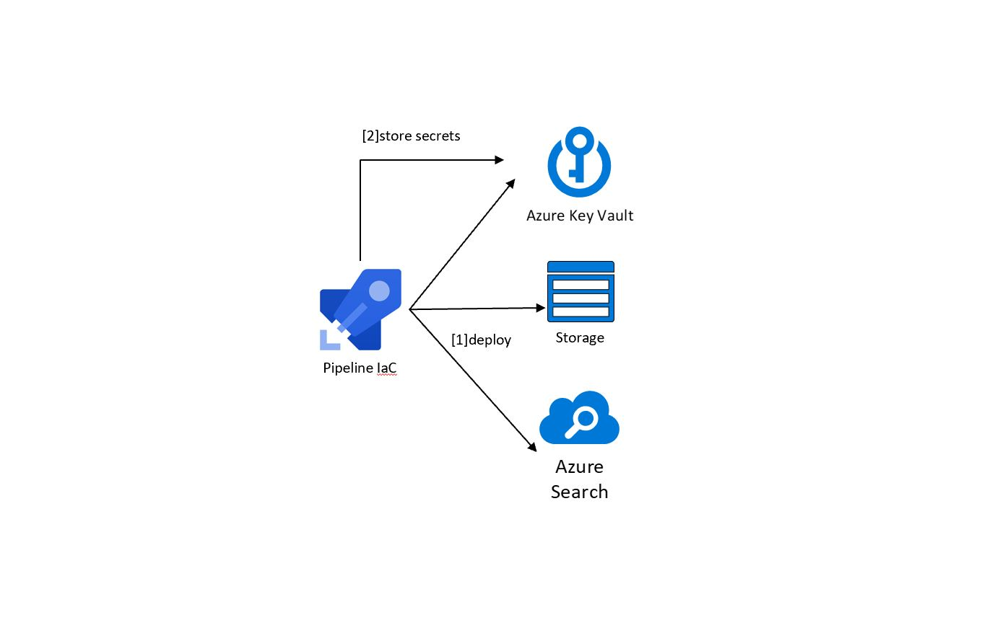
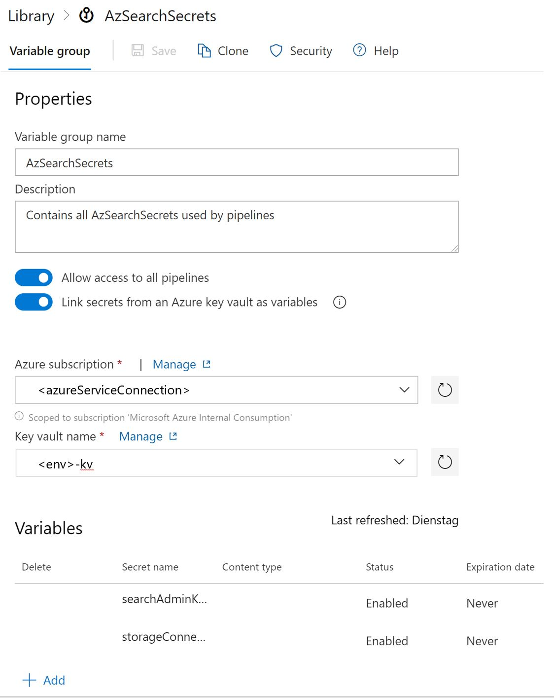
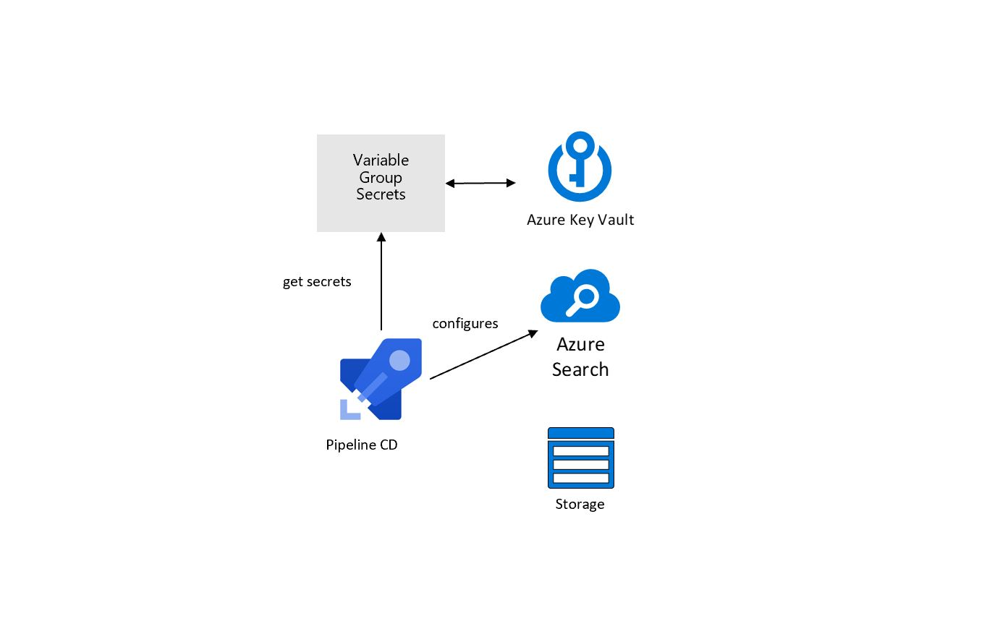
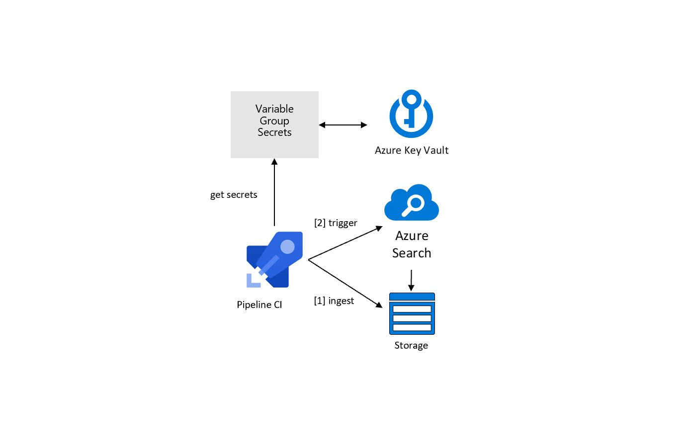

# Introduction 
The purpose of this project is to provide an basic set of ADO pipelines to setup an AzSearch project which is indexing json files on Azure Blob storage. 

A sample configuration / data is part of the project for validation. The AzSearch configuration is easy to extend by customizing the search-schema files and extend the token logic as needed. Advanced Search features can be added using the same pattern.

The AzSearch CI pipeline is deloying a static file but can be extended to do data preperation tasks as well i.e. using python scripts or other tools



# Getting Started
1. Create ADO project using Git - [Create project](https://docs.microsoft.com/en-us/azure/devops/organizations/projects/create-project?view=azure-devops&tabs=preview-page)
1. Import this Git repo - [Import Repo](https://docs.microsoft.com/en-us/azure/devops/repos/git/import-git-repository?view=azure-devops)
1. Add ADO Task ReplaceTokens to your ADO Project [ReplaceTokens](https://marketplace.visualstudio.com/items?itemName=qetza.replacetokens)
1. Create a AzureServiceConnection in ADO - [Add Azure RM connection](https://docs.microsoft.com/en-us/azure/devops/pipelines/library/service-endpoints?view=azure-devops&tabs=yaml)

# Configure and run the IaC pipeline



1. Create the Azure-IaC pipeline in ADO referencing the YAML ```\azure-pipelines\azSearch-IaC.yaml``` file in the repo
1. Set minimum required variables in ```azSearch-IaC.yaml``` :

    | Variable   | Describtion |
    | -------- | ---------- |
    | ```envInstanceName```    |  [8 chars] needs to be unique. Will be used to compose the azure resource names   |
    | ```azureServiceConnection``` | AzureServiceConnection name      |
    | ```azureLocation```| your Azure default location       |

1. Run the IaC pipeline. Verify in your Azure portal that AzSearch, Storage and KeyVault has been created.

# Configure the Variable Group to store secrets
1. Create a Variable Group in ADO ```> Pipelines > Library > Add Variable Group```
1. Name : ```AzSearchSecrets``` *Note: Changing the name requires to update references in the CD and CI pipeline*
1.  Bind the created KeyVault to the Variable Group
1.  Add the Secrets from KeyVault



# Configure and run the CD pipeline



1. Create the Azure-IaC pipeline in ADO referencing the YAML ```\azure-pipelines\azSearch-CD.yaml``` file in the repo
1. Set minimum required variables in ```azSearch-CD.yaml``` :

    | Variable   | Describtion |
    | -------- | ---------- |
    | ```appInstanceName```    |  needs to match IaC envInstanceName   |

1. Run the CD pipeline. Verify in your Azure portal that AzSearch Datasource, Index and Indexer has been created

# Configure and run the CI pipeline



1. Create the Azure-IaC pipeline in ADO referencing the YAML ```\azure-pipelines\azSearch-CI.yaml``` file in the repo
1. Set minimum required variables in ```azSearch-CI.yaml``` :

    | Variable   | Describtion |
    | -------- | ---------- |
    | ```appInstanceName```    |  needs to match IaC envInstanceName   |
    | ```azureServiceConnection``` | AzureServiceConnection name      |

1. Run the CI pipeline. Verify in your Azure portal that the sample tx.json has been copied to the storage container and the AzSerach Indexer has been started. Test out the search index.